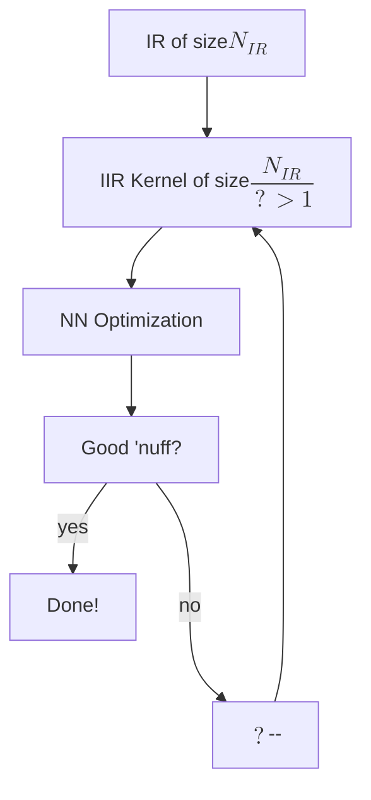

# IR-Approx: IIR Approximation of FIR Impulse Responses Using Neural Networks

This repository documents development of **IR-Approx**. For our proposal, see [PROPOSAL.md](./PROPOSAL.md). For the initial prototype, see our [Colab Notebook](https://colab.research.google.com/drive/1jvvUkCaEiVgBp3HYy_lhlEEdbZr5T1Lq?usp=sharing).

### Block Diagram
